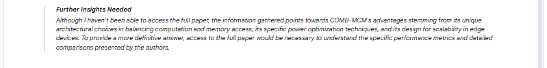

# CiHLab-PreSCE-2025-Zhuolin-Li-Problem2
The answer for CiHLab-PreSCE-2025 Problem 2

This project is based entirely on a deep research dialogue conducted via [Gemini](https://gemini.google.com/app). All the insights, analyses, and discussions stem from a conversation with Gemini, and are documented here for reference and sharing purposes.

## Screenshots

The following images are screenshots taken during the interaction with Gemini:

## Original Conversation

You can view the full original dialogue on Gemini via the following link:  
👉 [https://g.co/gemini/share/fa2bdb1c5211](https://g.co/gemini/share/fa2bdb1c5211)

## License

This project is licensed under the MIT License. See the [LICENSE](./LICENSE) file for details.

## Contact

If you have any questions, please raise an issue or contact us at
📧 **clement.zhuolin.li@gmail.com**
